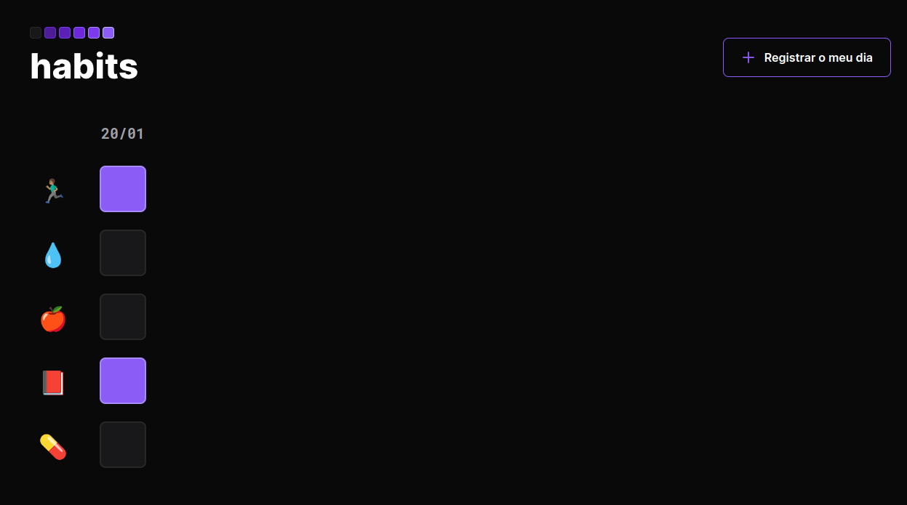

# Projeto Habits

Projeto desenvolvido na "Next Level Week" da Rocketseat utilizando-se de HTML5, CSS3 e JavaScript. 
No projeto será possível cadastrar hábitos e salvar localmente no navegador.

- [Inscreva-se e saiba mais!](https://app.rocketseat.com.br/)

- [Link para o projeto](https://acgoularthub.github.io/Next-Level-Week-Habits/)
## Como executar

Para executar o projeto, basta abrir o arquivo `index.html` no seu navegador.

## Como contribuir

1. Faça um fork do projeto
2. Crie uma branch com a sua feature (`git checkout -b feature/FeatureIncrivel`)
3. Faça o commit das suas alterações (`git commit -m 'Adicionando uma Feature Incrível!`)
4. Faça o push da sua branch (`git push origin feature/FeatureIncrivel`)
5. Abra uma pull request
6. Aguarde a aprovação da sua pull request
7. Pronto! Você contribuiu para o projeto!

# Resultado esperado

